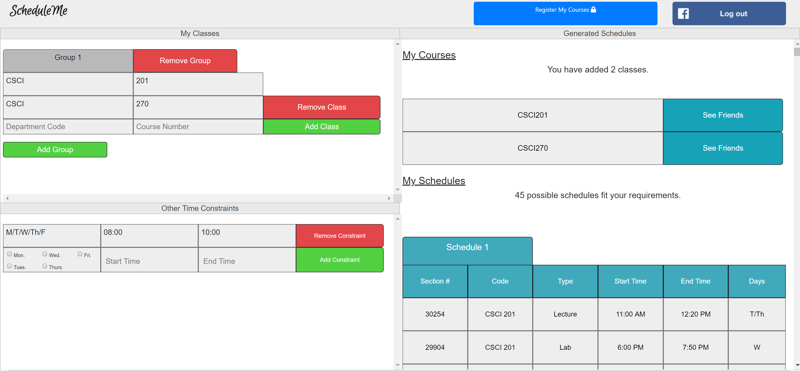

# CSCI 201 Principles of Software Development Final Project
csci201 group 10 final project

ScheduleMe is a web-based application aiming to automatically generate all possible schedules based on the user’s course load and personal time constraints. 

The application do Web-scraping from classes.usc.edu to get all courses information. 

      
